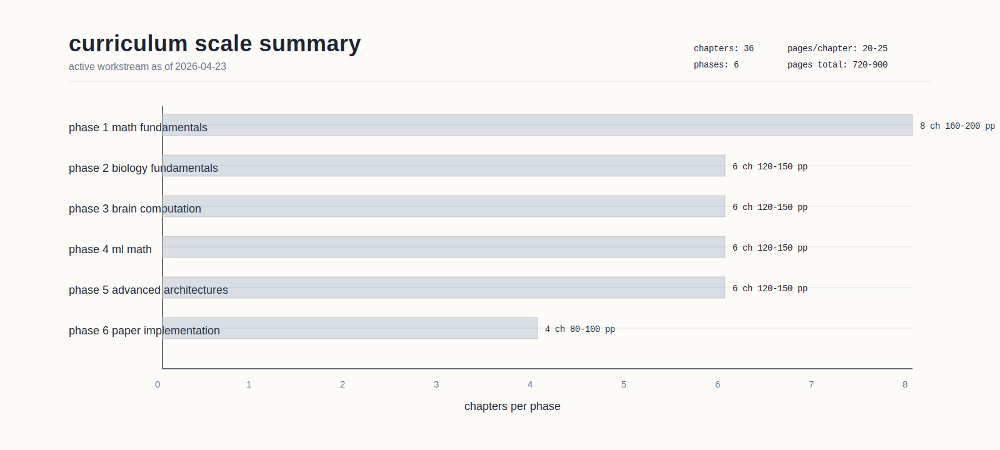
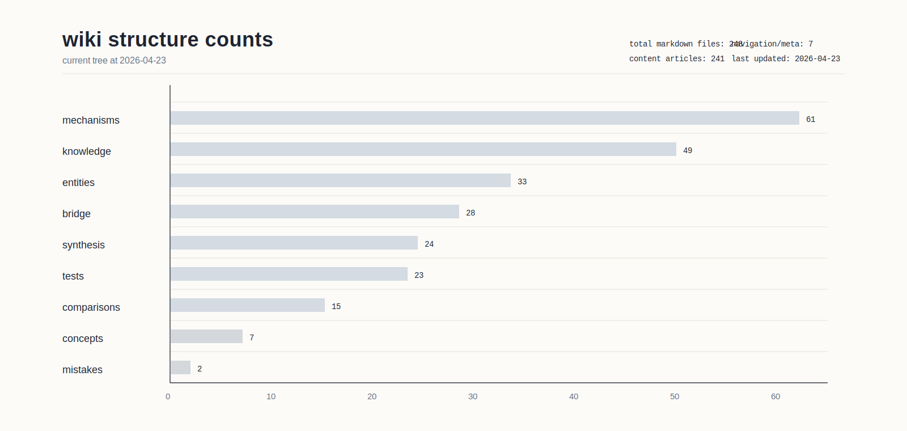

# eptesicus laboratories research wiki

status: current (as of 2026-04-23, curriculum pivot retained, the research-swarm synthesis and first visual program added, and the naming/history cleanup applied).

## active workstream: teaching curriculum

as of 2026-04-22 the project's active workstream is the teaching PDF curriculum specified at `~/.claude/plans/compressed-dancing-haven.md`. paid compute remains paused indefinitely. 36 chapters across 6 phases (math fundamentals, biology fundamentals, brain computation, ML math, advanced architectures and compression, paper implementation) at 20-25 pages per chapter. see `INDEX.md` section "teaching curriculum" and `PROJECT_PLAN.md` section "curriculum track" for the chapter list and production protocol.

## neuroloc -- biological neural computation

the neuroloc wiki maps brain computation mechanisms to todorov's CRBR framework. 61 mechanism articles, 28 bridge documents (25 current + 3 legacy-title redirects), 24 synthesis articles, 15 comparisons (14 current + 1 legacy-title redirect), 33 entity notes, 20 test records, 1 supporting prototype note, 1 historical series landing page, 2 mistake docs, 49 knowledge articles, and 7 concept articles.

the architecture backlog is no longer described only as "pick the next paid run." the wiki now records a broader cpu-first method: phase 1 is judged by state + action, not next-token prediction alone, and the implemented symbolic `biology_phase1` battery is the starting point when the architecture track resumes after the curriculum.

the 2026-04-23 research pass added a second layer on top of that backlog method: new literature shelves, new synthesis pages on replay, routing, world models, and multi-timescale computation, plus a first batch of recreated visuals that can be reused in both the wiki and the teaching curriculum.

start here: [[start_here]]

role split:
- this page = landing page and current orientation
- [[start_here]] = guided reading path for a new reader
- [[INDEX|catalog]] = flat catalog of all wiki compartments
- [[PROJECT_PLAN]] = authoritative current state and decision rules

### quick navigation
- [[INDEX|catalog]] -- master catalog of all articles
- [[PROJECT_PLAN]] -- canonical project state
- [[OPERATING_DIRECTIVE]] -- binding rules for wiki and state updates
- [[log]] -- chronological record of all wiki operations
- [[tests/index|tests]] -- dated records of completed simulations and experiments
- [[research_implications_for_neural_model_direction]] -- ranked summary of what the latest research changes

### key bridge documents (biology -> todorov)
- [[neuron_models_to_atmn|neuron models -> ATMN]]
- [[plasticity_to_matrix_memory_delta_rule|plasticity -> matrix-memory delta rule]]
- [[sparse_coding_to_ternary_spikes|sparse coding -> ternary spikes]]
- [[lateral_inhibition_to_adaptive_threshold|lateral inhibition -> adaptive threshold]]
- [[oscillations_to_mamba3_rotation|oscillations -> Mamba3 rotation]]
- [[memory_systems_to_matrix_memory_and_compressed_attention|memory systems -> matrix memory + compressed attention]]
- [[dendritic_computation_to_swiglu|dendritic computation -> SwiGLU]]
- [[spatial_computation_to_pga|spatial computation -> PGA]]
- [[global_workspace_to_residual_stream|global workspace -> residual stream]]
- [[positional_encoding_to_rope|positional/phase coding -> RoPE]]
- [[normalization_to_rmsnorm|biological normalization -> RMSNorm]]

### synthesis (cross-cutting themes)
- [[phase1_evaluation_surface_for_neural_models|phase 1 evaluation surface for neural models]]
- [[synthetic_shared_world_bridge|synthetic shared-world bridge]]
- [[substrate_requires_architectural_change|substrate requires architectural change]]
- [[training_objective_vs_architectural_goal|training objective vs architectural goal]]
- [[research_implications_for_neural_model_direction|research implications for neural model direction]]
- [[beyond_next_token_for_neural_models|beyond next-token for neural models]]
- [[world_models_imagination_and_planning|world models, imagination, and planning]]
- [[working_memory_as_controlled_access|working memory as controlled access]]
- [[attention_as_precision_and_routing|attention as precision and routing]]
- [[cross_scale_building_blocks_for_biological_computation|cross-scale building blocks for biological computation]]
- [[sparsity_from_biology_to_ternary_spikes|sparsity: biology to ternary spikes]]
- [[timescale_separation|timescale separation]]
- [[local_vs_global_computation|local vs global computation]]
- [[compression_and_bottlenecks|compression and bottlenecks]]
- [[recurrence_vs_feedforward|recurrence vs feedforward]]

### current backlog method
- [[phase1_evaluation_surface_for_neural_models|phase 1 battery]] -- recognition, recollection, interference resistance, delayed use, episodic reuse, and later iterative reasoning, with state/action/joint-success metrics
- [[synthetic_shared_world_bridge|phase 2 bridge]] -- extend the same latent-world tests into symbolic + image + toy-audio views of one exact hidden state
- [[state_action_memory_architecture_direction|state-action memory direction]] -- the current architecture-level translation of the new research cluster
- [[substrate_requires_architectural_change|architectural interventions]] -- the ranked A-E candidate list that remains in the backlog while the curriculum is active

### new research shelves and visual narratives
- [[systems_neuroscience_research|systems neuroscience research]]
- [[cellular_molecular_neurobiology_research|cellular and molecular neurobiology research]]
- [[cognitive_architecture_research|cognitive architecture research]]
- [[cross_scale_building_blocks_research|cross-scale building blocks research]]
- [[architectures_beyond_next_token_research|architectures beyond next-token research]]
- [[canonical_visual_narratives_neuroscience|canonical visual narratives: neuroscience]]
- [[canonical_visual_narratives_mind_and_memory|canonical visual narratives: mind and memory]]
- [[canonical_visual_narratives_world_models|canonical visual narratives: world models]]

### mechanism domains
- [[leaky_integrate_and_fire|single neuron models]] (4 articles)
- [[hebbian_learning|synaptic plasticity]] (6 articles)
- [[sparse_coding|neural coding]] (4 articles)
- [[lateral_inhibition|lateral inhibition]] (4 articles)
- [[predictive_coding|predictive processing]] (3 articles)
- [[cortical_column|cortical microcircuits]] (4 articles)
- [[gamma_oscillations|oscillatory dynamics]] (3 articles)
- [[dopamine_system|neuromodulation]] (5 articles)
- [[hippocampal_memory|memory systems]] (4 articles)
- [[dendritic_computation|dendritic computation]] (4 articles)
- [[brain_energy_budget|energy and metabolism]] (3 articles)
- [[selective_attention|attention]] (3 articles)
- [[critical_periods|development and learning]] (3 articles)
- [[place_cells|spatial computation]] (4 articles)
- [[global_workspace_theory|consciousness and integration]] (4 articles)
- [[gaba_signaling|inhibitory signaling]] (2 articles)
- [[basal_ganglia|action selection]] (1 article)

### introductory articles
- [[start_here]] -- entry point and reading order
- [[the_brain_in_one_page]] -- 80/20 neuroscience for ML engineers
- [[neuroscience_for_ml_engineers]] -- the big primer
- [[mathematical_foundations]] -- math with worked examples
- [[todorov_biology_map]] -- every component mapped to biology
- [[glossary]] -- 73 terms in plain language

### todorov architecture knowledge
- [[unified_theory]] -- CRBR framework
- [[ternary_spikes]] -- spike theory and validation
- [[kda_channel_gating]] -- delta rule and forgetting
- [[mla_compression]] -- latent attention
- [[mamba3_architecture]] -- state space models
- [[geometric_algebra]] -- PGA G(3,0,1)
- [[delta_rule_theory]] -- online learning
- [[hybrid_architectures]] -- layer ratios
- [[training_efficiency]] -- optimization
- [[context_extension]] -- long context
- [[papers_library]] -- full paper database

## see also

- [[INDEX]]
- [[PROJECT_PLAN]]
- [[OPERATING_DIRECTIVE]]
- [[log]]
