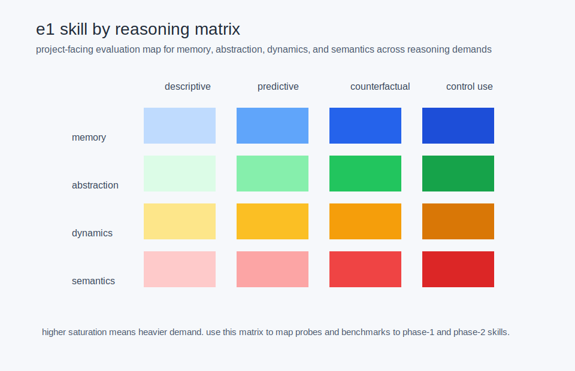

# bridge: visuals to phase 1 nm tests

status: current (as of 2026-04-23).

## purpose

the new visual program should not float above the evaluation program. each canonical visual should teach or constrain a real phase-1 gate.

## mapping

- `n2_predictive_coding_stack` -> recognition and belief-state formation
- `n4_dendritic_coincidence_and_bac` -> gated write or context-sensitive routing probes
- `m1_hippocampal_indexing_vs_concept_coding` -> associative recollection and degraded-cue recall
- `m2_complementary_learning_and_replay` -> episodic reuse and replay benefit
- `a2_world_model_control_loop_comparison` -> iterative rollout and hard-case compute gain
- `e1_skill_by_reasoning_matrix` -> benchmark and probe decomposition across the whole phase-1 surface

## why this matters

the project is explicitly moving away from passkey-only gating. the visual layer should reinforce that broader battery rather than silently collapse back to one score.

## see also

- [[phase1_evaluation_surface_for_neural_models]]
- [[synthetic_shared_world_bridge]]
- [[benchmark_skill_taxonomies]]
- [[visual_sources_cognitive_architecture]]
- [[canonical_visual_narratives_world_models]]
