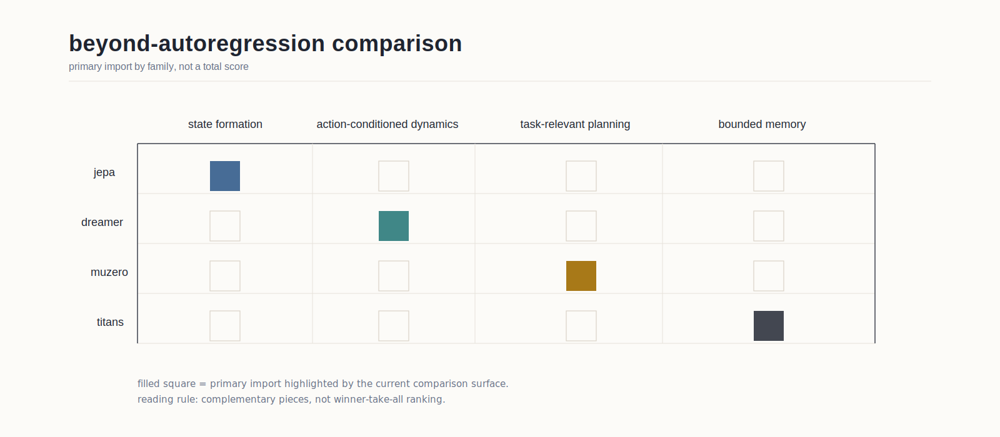

# comparison: dreamer muzero jepa titans

status: current (as of 2026-04-23).

this comparison keeps four external architecture families separate because they solve different parts of the problem.

## the short version

- `dreamer` is strongest on latent imagination and behavior learning from a recurrent belief state
- `muzero` is strongest on planning-relevant latent models without full reconstruction
- `jepa` is strongest on latent state formation without surface reconstruction as the main training target
- `titans` is strongest on bounded surprise-gated memory as a support mechanism

## what each family buys

### dreamer

best import: latent state plus action-conditioned rollout.

### muzero

best import: task-relevant latent planning without forcing full reconstruction.

### jepa

best import: state learning by latent target prediction rather than token continuation.

### titans

best import: surprise-gated bounded memory at test time.

## what does not map cleanly

- dreamer is not a whole memory theory
- muzero is not a general self-supervised state-learning recipe
- jepa is not yet a full planning stack on its own
- titans is not a substitute for a world model

## project-facing conclusion

the project should read these four families as a stack of lessons, not as a winner-take-all menu.

## see also

- [[architectures_beyond_next_token_research]]
- [[visual_sources_beyond_autoregression]]
- [[beyond_next_token_for_neural_models]]
- [[state_action_memory_architecture_direction]]
- [[canonical_visual_narratives_world_models]]
