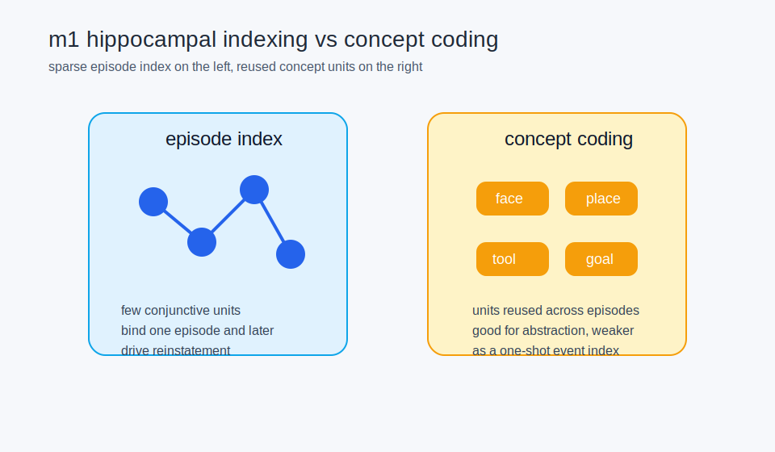
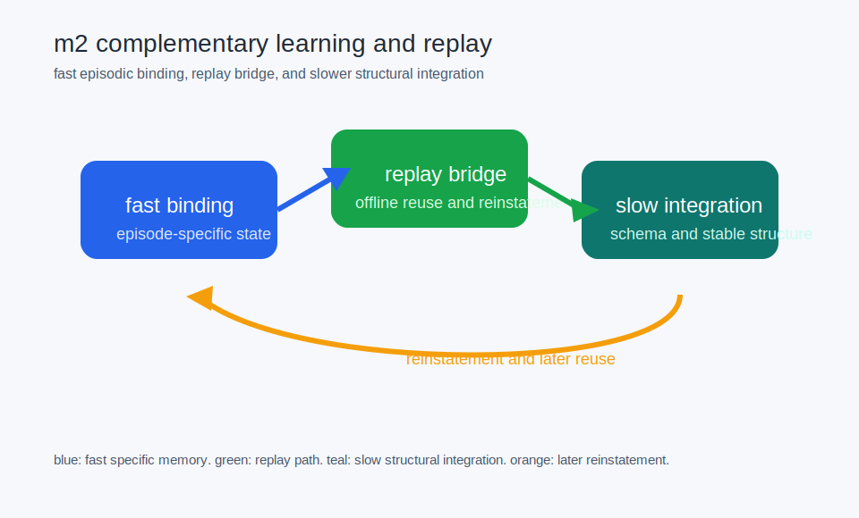

# canonical visual narratives mind and memory

status: current (as of 2026-04-23).

this page selects the first visual canon for working memory, indexing, replay, and coordination.

## selected first-batch visuals

- `m1_hippocampal_indexing_vs_concept_coding`
- `m2_complementary_learning_and_replay`

## why these two

they give the cleanest picture of:

- how episodic memory can be sparse and reconstructive
- how fast binding and slow integration fit together through replay

## where they should be used

- curriculum chapters on hippocampus and consolidation
- synthesis pages on working memory, imagination, and world models

## see also

- [[visual_sources_cognitive_architecture]]
- [[visuals_to_phase1_nm_tests]]
- [[visuals_to_curriculum_chapters]]
- [[working_memory_as_controlled_access]]
- [[world_models_imagination_and_planning]]
- [[visual_grammar_for_wiki_and_curriculum]]
