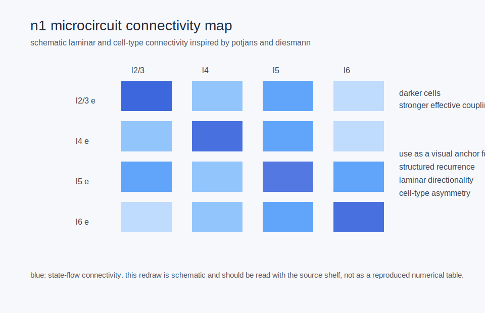
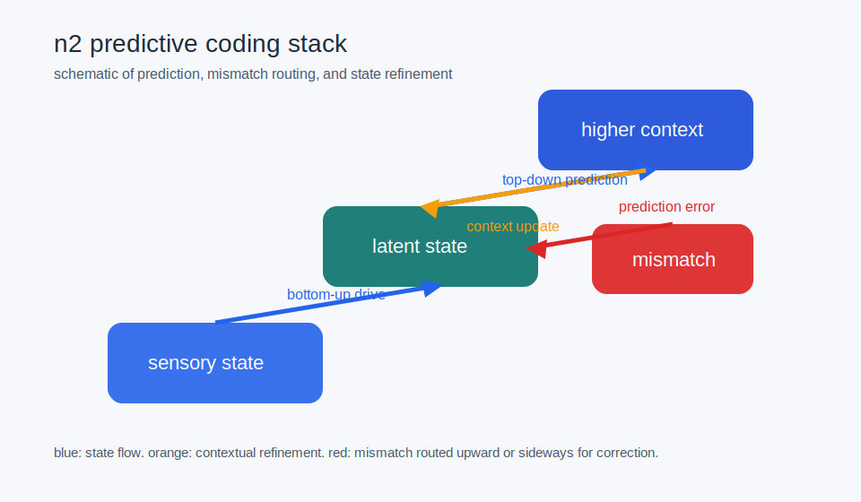
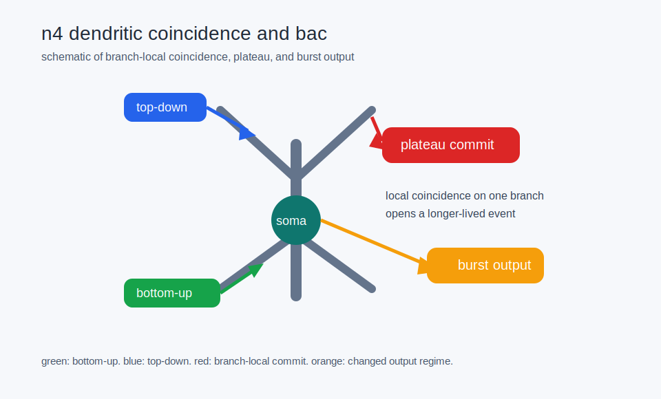

# canonical visual narratives neuroscience

status: current (as of 2026-04-23).

this page selects the neuroscience visuals that should become the stable visual spine for the wiki and curriculum.

## selected first-batch visuals

- `n1_microcircuit_connectivity_map` — layered cortical connectivity and flow
- `n2_predictive_coding_stack` — layered prediction and mismatch routing
- `n4_dendritic_coincidence_and_bac` — branch-local coincidence, plateau, and burst

## why these three

they cover the highest-leverage narrative arc:

- structured circuits
- structured inference and routing
- structured local computation

## where they should be used

- curriculum chapters on circuits, cortex, predictive coding, and compartmental neurons
- synthesis pages on routing, primitives, and cellular computation

## see also

- [[visual_sources_systems_neuroscience]]
- [[visuals_to_phase1_nm_tests]]
- [[visuals_to_curriculum_chapters]]
- [[visual_grammar_for_wiki_and_curriculum]]
- [[cellular_molecular_computational_primitives]]
- [[attention_as_precision_and_routing]]
