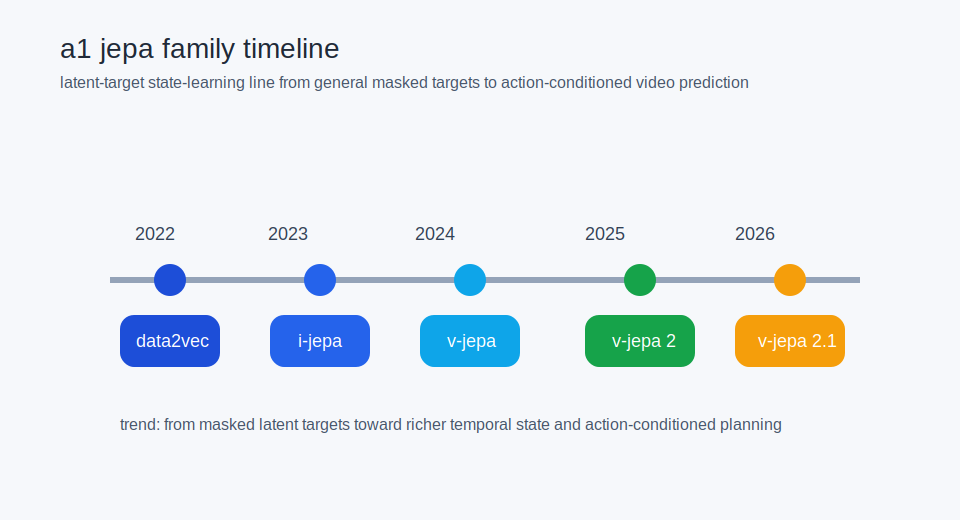
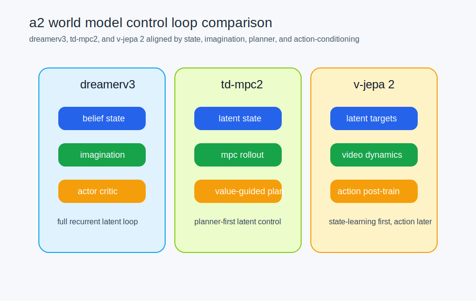

# canonical visual narratives world models

status: current (as of 2026-04-23).

this page selects the first visual canon for latent-state learning, world models, and architecture comparison beyond autoregression.

## selected first-batch visuals

- `a1_jepa_family_timeline`
- `a2_world_model_control_loop_comparison`

## why these two

they answer two different questions cleanly:

- where did the latent-target state-learning line come from
- how do the strongest state-action architectures differ at the control-loop level

## where they should be used

- synthesis pages on beyond-next-token design
- comparison pages on external architecture families
- later curriculum chapters on modern world models and paper implementation

## see also

- [[visual_sources_beyond_autoregression]]
- [[visuals_to_phase1_nm_tests]]
- [[visuals_to_curriculum_chapters]]
- [[architectures_beyond_next_token_research]]
- [[beyond_next_token_for_neural_models]]
- [[dreamer_muzero_jepa_titans]]
- [[visual_grammar_for_wiki_and_curriculum]]
