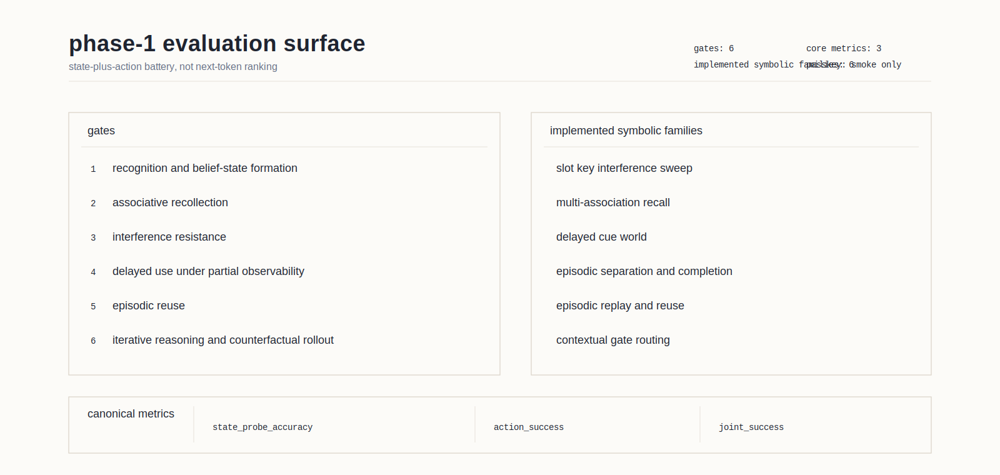

# phase 1 evaluation surface for neural models

status: current (as of 2026-04-23).

## why this article exists

the local project history already established one negative result: shaping the
training corpus toward retrieval is necessary, but it is not sufficient. the
paid cognition run (`run3_cognition_phase1`) made retrieval an explicit 50
percent fraction of the training blocks and still produced 0/100 passkey. the
external literature sharpens the same point from the other direction. the best
memory and world-model benchmarks do not treat "intelligence" as one score.
they separate recognition, associative recall, interference resistance,
partial-observability control, episodic reuse, and iterative inference.

phase 1 therefore needs its own evaluation surface. it should not be framed as
"next-token prediction with harder prompts," and it should not be framed as
"passkey plus a few extras." it should be framed as a battery of small,
controlled tests for the abilities the architecture is supposed to provide.

## the six phase-1 gates

### 1. recognition and belief-state formation

the first question is whether the model can infer a stable latent state from
aliased observations. this is the minimal form of understanding. the model does
not need to verbalize anything. it needs to maintain the right internal guess
about what is present, where it is, and what is currently hidden.

good external anchors:

- worldsense shows how to build synthetic worlds without answer-prior shortcuts.
- popgym shows that small partially observable tasks are enough to expose memory
  dependence.
- predictive-coding meta-rl work shows that belief-state quality can improve
  even when final policy quality looks similar.

recommended local measurements:

- exact hidden-state probe accuracy on aliased worlds
- calibration of belief over hidden variables
- degradation under distractors and occlusion

### 2. associative recollection

this is the direct memory gate. copy, repeat-copy, key-value recall, noisy cue
completion, and multi-association lookup all live here. the important lesson
from ntm, dnc, mqar, and atr-style tasks is that flat one-cue-one-value recall
is not enough. the system should retrieve several bound facts from one cue and
should survive partial corruption of the cue.

good external anchors:

- neural turing machines
- differentiable neural computer
- zoology / mqar
- mechanistic evaluation with atr-style hierarchical binding

recommended local measurements:

- exact recall
- cosine recall
- degraded-cue completion
- one-to-many retrieval from a single cue

### 3. interference resistance

this is the missing gate in most memory discussions. a system can look good on
clean recall and still fail as soon as keys are correlated, slots collide, or
new episodes keep arriving. the associative-learning benchmark, memory gym, and popgym
arcade all point in the same direction: interference has to be tested
separately from clean retrieval.

good external anchors:

- benchmarking hebbian learning rules for associative memory
- memory gym
- popgym arcade

recommended local measurements:

- recall as key correlation increases
- overwrite slope under shared-slot pressure
- endless-task drift under continuing writes
- comparison to shuffled-address and random-slot controls

### 4. delayed use under partial observability

the question here is not "can the model reconstruct a stored value when asked."
the question is "can the model use remembered information later to guide
behavior or inference." memory maze and popgym are strong because they separate
memory from confounding skills and because they support both online reward and
offline probes.

good external anchors:

- popgym
- memory maze
- delayed-cue t-maze style tasks

recommended local measurements:

- probe accuracy after delay
- control reward or task success after delay
- online performance separated from offline state probes

### 5. episodic reuse

phase 1 should include repeated latent tasks that return after many distractor
episodes. the target behavior is not just retention. it is faster reuse than
relearning. episodic-control and merlin style work are useful here because they
test whether old episodes become immediately actionable when a familiar
structure returns.

good external anchors:

- model-free episodic control
- merlin
- been there, done that
- memoryarena

recommended local measurements:

- improvement on repeated latent tasks without weight updates
- reuse advantage over recency-only and no-memory baselines
- retention across long distractor intervals

### 6. iterative reasoning and counterfactual rollout

phase 1 reasoning should mean controlled extra internal compute on hard cases.
it should not mean long text traces. mac, energy-based iterative reasoning,
universal transformer, clevrer, imagination-augmented agents, dreamer, and the
newer world-model benchmarks all support the same operational view: reasoning is
latent-state refinement and counterfactual rollout.

good external anchors:

- mac
- learning iterative reasoning through energy minimization
- universal transformers
- clevrer
- imagination-augmented agents
- dreamerv3
- worldtest / autumnbench

recommended local measurements:

- hard-case gain from 0, 1, 3, 5 internal iterations
- predictive and counterfactual accuracy on the same world state
- separation between easy-case and hard-case compute benefit

## what does not count as a phase-1 gate

- perplexity on natural text
- next-token loss on a corpus that can be fit locally
- passkey alone
- open-ended qa scored by another model
- chain-of-thought length
- visual realism

these may still be useful diagnostics later, but they do not test the phase-1
abilities directly.

## trainability controls are part of the evaluation surface

external work on recurrent systems adds a second warning. even when a task is
memory-shaped, sgd can still fail for dynamical reasons. recent results on
learning-rate collapse in recurrent networks, sudden learning via bifurcation,
predictive modules improving belief-state learning, mimetic initialization
improving recall, and unexplored-state failures in modern recurrent models all
point to the same rule: task design and trainability have to be tested
separately.

before any paid run, a candidate substrate should therefore be stress-tested
under these controls:

- oracle write / learned read
- learned write / oracle read
- hand-placed addresses or hand-opened gates
- gate-init sweeps
- key orthogonality or slot-usage entropy sweeps
- explicit logging of gate-open fraction, slot entropy, and belief-state probe
  quality
- no-memory, recency-only, and shuffled-address controls

this is the direct follow-up to the local slot-memory result. cpu gates A and B
already showed that the mechanism can retrieve when addresses are placed by
hand. the next battery has to ask which part of the trainable loop fails:
address formation, write selection, read selection, or output usage.

## current local implementation status (2026-04-22)

the article is no longer only a design note. the repo now contains the first
implemented symbolic core of this battery in `neuroloc/simulations/`, with a
dedicated `biology_phase1` suite folded into `phase1_nm`.

implemented families and their local role:

- `simulations/memory/slot_key_interference_sweep.py` — interference resistance
  under correlated addresses
- `simulations/memory/multi_association_recall.py` — one-cue many-value
  recollection
- `simulations/memory/delayed_cue_world.py` — delayed use under partial
  observability
- `simulations/memory/episodic_separation_completion.py` — separation,
  completion, novelty, and delayed-use after distractors
- `simulations/memory/episodic_replay_reuse.py` — replay, reuse, and distractor
  resistance
- `simulations/memory/contextual_gate_routing.py` — bottom-up / top-down
  disambiguation with gate-open and gate-closed controls

the implemented battery now standardizes three top-line measurements wherever
the task allows it:

- `state_probe_accuracy`
- `action_success`
- `joint_success`

this matters because phase 1 is no longer framed as "can it emit the next
symbol?" it is framed as "did it form the right state, did it do the right
thing, and do those two stay coupled rather than drifting apart through action
label collisions."

## the 2026-04-23 support layer

this evaluation surface now has a better theory base around it than it had on
2026-04-22. the new support layer is split deliberately by role:

- literature shelves:
  [[systems_neuroscience_research]],
  [[cellular_molecular_neurobiology_research]],
  [[cognitive_architecture_research]],
  [[cross_scale_building_blocks_research]],
  [[architectures_beyond_next_token_research]]
- synthesis:
  [[working_memory_as_controlled_access]],
  [[attention_as_precision_and_routing]],
  [[world_models_imagination_and_planning]],
  [[beyond_next_token_for_neural_models]],
  [[cross_scale_building_blocks_for_biological_computation]],
  [[research_implications_for_neural_model_direction]]
- bridge:
  [[state_action_memory_architecture_direction]],
  [[indexing_to_memory_interfaces]],
  [[replay_to_offline_credit_assignment]],
  [[visuals_to_phase1_nm_tests]]

that split matters because the battery should be sourced from evidence and then
translated into tests, not assembled from slogans.

## the recommended minimal cpu battery in this repo

keep the existing line and extend it. the current simulations now already
contain the right symbolic seeds:

- `simulations/memory/asymmetric_outer_product_recall.py`
- `simulations/memory/pattern_completion.py`
- `simulations/memory/slot_buffer_capacity.py`
- `simulations/memory/slot_surprise_writes.py`
- `simulations/memory/contextual_recall_world.py`
- `simulations/memory/slot_key_interference_sweep.py`
- `simulations/memory/multi_association_recall.py`
- `simulations/memory/delayed_cue_world.py`
- `simulations/memory/episodic_separation_completion.py`
- `simulations/memory/episodic_replay_reuse.py`
- `simulations/memory/contextual_gate_routing.py`

the remaining additions should stay narrow and explicit:

- `simulations/reasoning/iterative_rollout_probe.py`
- model-side NM evaluation wiring that reports the same state / action / joint
  metrics as the symbolic battery

the naming change from the original note matters: the repo now uses
`delayed_cue_world.py` and `episodic_replay_reuse.py` rather than the older
placeholder names `delayed_cue_gridworld.py` and `episodic_reuse_world.py`.

the pass condition should be conjunctive, not singular. a candidate substrate
should show:

- nontrivial associative recall above matched controls
- graceful degradation under interference rather than immediate collapse
- delayed-use benefit in a small partially observable world
- episodic reuse benefit over relearning
- extra internal compute helping hard cases more than easy ones

passkey stays in the suite, but only as a smoke test.

## current local test surface

the local verification picture on 2026-04-22 is:

- the targeted `biology_phase1` / `phase1_nm` slice for the new battery passes
  cleanly
- the broader phase-1-relevant test slice still has failures outside this new
  battery, concentrated in the long-standing Windows / NumPy subprocess crashes
  around `hierarchical_ternary`, `wta_dynamics`, and an intermittent
  `thinking_loop_prototype` subprocess run

that means the symbolic phase-1 battery is usable as local evidence, but the
repo still has a separate runtime-stability track in the older smoke-suite
surface. the two should not be conflated.

## see also

- [[training_objective_vs_architectural_goal]]
- [[substrate_requires_architectural_change]]
- [[slot_memory_design]]
- [[synthetic_shared_world_bridge]]
- [[working_memory_as_controlled_access]]
- [[attention_as_precision_and_routing]]
- [[state_action_memory_architecture_direction]]
- [[visuals_to_phase1_nm_tests]]
- [[indexed_reconstruction_compression]]
- [[neural_model_research_test_material_plan]]
- [[tests/run3_cognition_phase1_results]]

## references

- [neural turing machines](https://arxiv.org/abs/1410.5401)
- [hybrid computing using a neural network with dynamic external memory](https://www.nature.com/articles/nature20101)
- [evaluating long-term memory in 3d mazes](https://arxiv.org/abs/2210.13383)
- [popgym: benchmarking partially observable reinforcement learning](https://arxiv.org/abs/2303.01859)
- [zoology: measuring and improving recall in efficient language models](https://arxiv.org/abs/2312.04927)
- [benchmarking hebbian learning rules for associative memory](https://arxiv.org/abs/2401.00335)
- [memory gym](https://jmlr.org/papers/volume26/24-0043/24-0043.pdf)
- [investigating memory in rl with popgym arcade](https://arxiv.org/abs/2503.01450)
- [mechanistic evaluation of transformers and state-space models](https://openreview.net/forum?id=F62dVLJ8wk)
- [compositional attention networks for machine reasoning](https://arxiv.org/abs/1803.03067)
- [learning iterative reasoning through energy minimization](https://proceedings.mlr.press/v162/du22d.html)
- [universal transformers](https://arxiv.org/abs/1807.03819)
- [clevrer](https://arxiv.org/abs/1910.01442)
- [dreamerv3](https://arxiv.org/abs/2301.04104)
- [worldsense](https://arxiv.org/abs/2311.15930)
- [benchmarking world-model learning](https://arxiv.org/abs/2510.19788)
- [mind: benchmarking memory consistency and action control in world models](https://arxiv.org/abs/2602.08025)
- [predictive coding enhances meta-rl to achieve interpretable bayes-optimal belief representation under partial observability](https://openreview.net/forum?id=ykDUVoelgj)
- [learning rate collapse prevents training recurrent neural networks at scale](https://openreview.net/forum?id=pFs3jNjT5f)
- [why do recurrent neural networks suddenly learn? bifurcation mechanisms in neuro-inspired short-term memory tasks](https://openreview.net/forum?id=njmXdqzHJq)
- [mimetic initialization helps state space models learn to recall](https://arxiv.org/abs/2410.11135)
- [understanding and improving length generalization in recurrent models](https://openreview.net/pdf/9c851f12b6286ead947ef2773ac6e718bc94f5f2.pdf)
- [stuffed mamba: oversized states lead to the inability to forget](https://openreview.net/forum?id=CdRauNXD1w)
